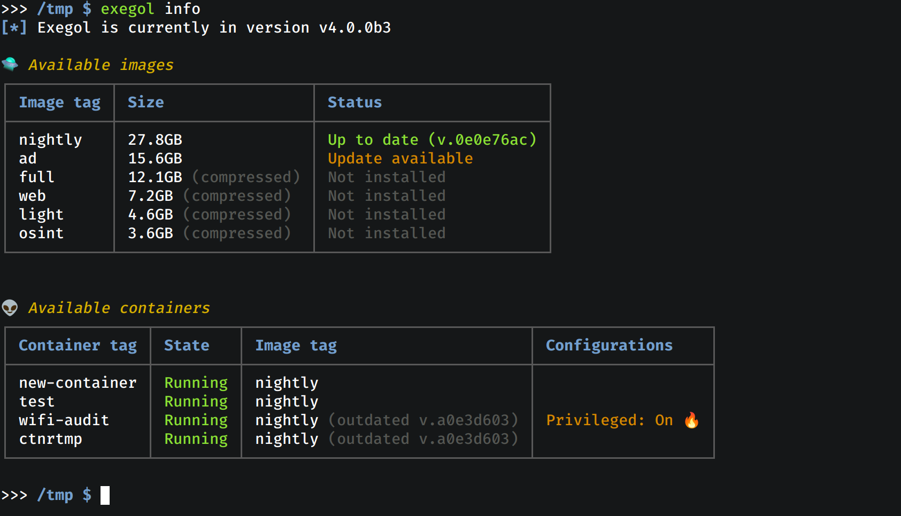
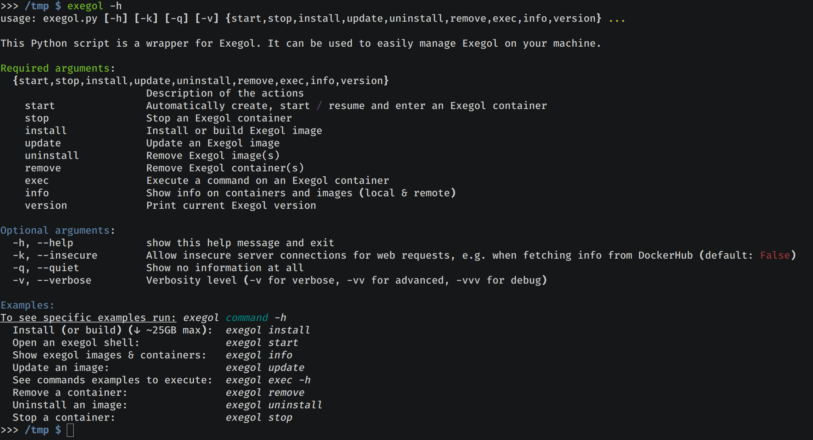
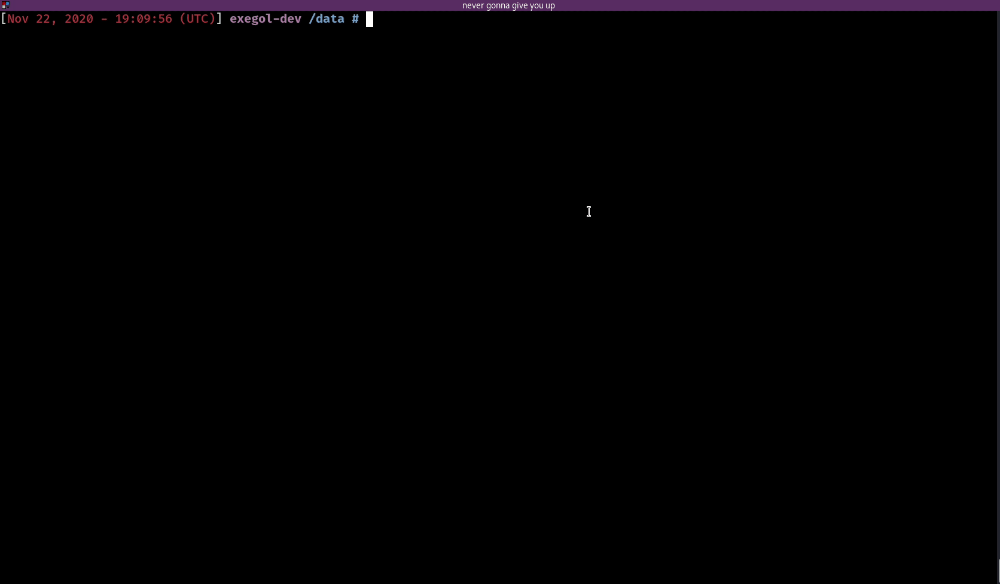

> **Want to quick start without reading anything else? [Click here](#-get-started)**

# The Exegol project

<div align="center">

  [](https://hub.docker.com/r/nwodtuhs/exegol)
  [](https://hub.docker.com/r/nwodtuhs/exegol)
  [%20max%20size)](https://hub.docker.com/r/nwodtuhs/exegol)
  <br>
  [](https://pypi.org/project/Exegol/)
  [](https://pypi.org/project/Exegol/)
  
  
  <br>
  
  
  
  <br>
  <a href="https://twitter.com/intent/follow?screen_name=_nwodtuhs" title="Follow"></a>
  <a href="https://twitter.com/intent/follow?screen_name=Dramelac_" title="Follow"></a>
  <br><br>
</div>

> Exegol is a community-driven hacking environment, powerful and yet simple enough to be used by anyone in day to day engagements.
> Script kiddies use Kali Linux, real pentesters use Exegol, megachads maintain it 👀

## Wrapper & images
Exegol is two things in one. Try it, and you'll stop using your old, unstable and risky environment, no more Kali Linux as host or single VM.
- **a python wrapper** making everyone's life easier. It handles all docker and git operations so you don't have to, and it allows for l33t hacking following best-practices. No more messed up history, libraries, and workspaces. **Now's the time to have a clean environment** with one container per engagement without the effort. Exegol handles multiple images and multiple containers.
    - Want to test a new tool without risking messing up your environment? Exegol is here, pop up a new container in 5 seconds and try the tool without risk or effort
    - Like the idea of using docker containers without effort but don't want to sacrifice GUI tools like BloodHound and Burp? Exegol is here, new containers are created with X11 sharing by default allowing for GUI tools to work.
    - Like the idea of using docker containers but want to use USB accessories, Wi-Fi, host's network interfaces, etc.? Exegol handles all that flawlessly
    - Want to stop pentesting your clients with the same environment everytime, interconnecting everything and risking being a weak link? Exegol is here, pop multiple containers without breaking a sweat and lead by example!
    - You like this idea but don't want to lose your work when quitting/removing a container? Exegol shares a workspace directory per container with your host, allowing you to work knowing your progress won't be lost.
- a set of pre-built **docker images** and dockerfiles that include a neat choice of tools, awesome resources, custom configs and many more.
    - Fed up with the instability and poor choice of tools of Kali Linux ? Exegol is here, trying to correct all this by being community-driven. Want some not-so-famous tool to be added? Open an issue and let's talk do it!
    - Tired of always having to open `man` or print the help for every tool because the syntax varies? Exegol includes a command history allowing you to just replace the placeholders with your values, saving you precious time
    - Want to improve productivity? Exegol includes all sorts of custom configs and tweaks with ease of use and productivity in mind (colored output for Impacket, custom shortcuts and aliases, custom tool configs, ...).
    - Want to build your own docker images locally? It's absolutely possible and the wrapper will help in the quest.
    - Tired of always having to search github for your favorite privesc enumeration script? Exegol includes a set of resources, shared with all exegol containers and your host, including LinPEAS, WinPEAS, LinEnum, PrivescCheck, SysinternalsSuite, mimikatz, Rubeus, PowerSploit and many more.



> Exegol was built with pentest engagements in mind, but it can also be used in CTFs, Bug Bounties, HackTheBox, OSCP, and so on.

- 🔧 **Tools**: many tools that are either installed manually or with apt, pip, go etc. Some of those tools are in kali, some are not. Exegol doesn't come with only ultra-famous tools, you will find ones that the community loves to use, even if it's in dev/new/not famous. Some tools are pre-configured and/or customized (colored output, custom NtChallengeResponse in Responder, custom queries in BloodHound, ...)
- 💡 **Resources**: many resources can be useful during engagements. Those resources are not referred to as "tools" since they need to be run on a pwned target, and not on the attacker machine (e.g. mimikatz, rubeus, ...).
- 📜 **History**: a populated history file that allows exegol users to save time and brain space by not having to remember every tool option and argument or checking the "help" every time.
- 🚀 **Aliases**: a file containing aliases that can be handful when using manually installed tools, or doing common operations.
- 🔎 **Usage**: a powerful Python3 wrapper used to manage Exegol container and image very easily (handles every docker operations).

## Project structure

Below are some bullet points to better understand how Exegol works
- This repository ([Exegol](https://github.com/ShutdownRepo/Exegol)) contains the code for the Python wrapper. It's the entrypoint of the Exegol project.
- The [Exegol-images](https://github.com/ShutdownRepo/Exegol-images) repo is loaded as a submodule. It includes all necessary assets to build Docker images.
- The [Exegol-resources](https://github.com/ShutdownRepo/Exegol-resources) repo is loaded as a submodule. It includes all resources mentioned previously (LinPEAS, WinPEAS, LinEnum, PrivescCheck, SysinternalsSuite, mimikatz, Rubeus, PowerSploit and many more.).
- Getting started with the Exegol project comes down to using the wrapper, which can be installed through pip or with the sources directly (see. [get started](#fast_forward-get-started)).

# 🚀 Get started

> Keep in mind that the wrapper is one thing, but in order to use Exegol, at least one Exegol docker image must be installed.
> Installing the wrapper and running it will do the next steps (which can be a bit lengthy)

## Pre-requisites
You need :
- git
- python3
- docker
- and at least 20GB of free storage

> To run exegol from the user environment without `sudo`, the user must have privileged rights equivalent to root.
> To grant yourself these rights, you can use the following command: `sudo usermod -aG docker $(id -u -n)`
>
> For more information: https://docs.docker.com/engine/install/linux-postinstall/#manage-docker-as-a-non-root-user

You also need python libraries listed in [requirements.txt](./requirements.txt) (installed automatically or manually depending on the installation method you choose).

## Installation using pip

Exegol's wrapper can be installed from pip repository. That's the entrypoint of the project, you'll be able to do all the rest from there.
```
python3 -m pip install exegol
```

> Remember that pip install binaries in `~/.local/bin`, which then must be in the `PATH` environment variable.

## Installation from sources

Exegol's wrapper can also be installed from sources. The wrapper then knows how to self-update.

```
git clone https://github.com/ShutdownRepo/Exegol
cd Exegol
python3 -m pip install --user --requirement requirements.txt
```

## Add exegol command

<details>
  <summary><h4>On Linux / macOS</h4></summary>

The exegol wrapper can then be added to the `PATH` throw symlink for direct access.

```bash
sudo ln -s $(pwd)/exegol.py /usr/local/bin/exegol
```

</details>

<details>
  <summary><h4>On Windows (with Powershell)</h4></summary>

The exegol wrapper can be added as a powershell command aliases and saved for persistence
in `$HOME\PowershellAliasesExport.txt`
then load from `$PROFILE` script at powershell startup.

```powershell
$AliasFile = "$HOME\PowershellAliasesExport.txt"
Set-Alias -Name exegol -Value "$(pwd)\exegol.py"
Get-Alias -Name "exegol" | Export-Alias -Path $AliasFile
echo "Import-Alias '$AliasFile'" >> $PROFILE
```

> Warning! To automatically load aliases from the .ps1 file, the `Get-ExecutionPolicy` powershell must be set
> to `RemoteSigned`

If the configuration is not correct it can be configured as **administrator** with the following command:

```powershell
Set-ExecutionPolicy -ExecutionPolicy RemoteSigned
```

</details>

## User configuration

Exegol installs and uses a yaml configuration file, located in the user's home directory: `~/.exegol` (
or `/home/<user>/.exegol`).
The configuration file indicates paths to three host directories shared with the containers:

- "my resources": dedicated to the user to customize his environment and tools. Defaults
  to `/home/<user>/.exegol/my-resources`.
- "exegol resources": official exegol resources from
  the [Exegol-resources](https://github.com/ShutdownRepo/Exegol-resources) repo. Defaults
  to `/path/to/Exegol/exegol-resources`.
- "private workspace": a dedicated workspace for each container, shared with the host. Defaults
  to `/home/<user>/.exegol/workspaces`.

## Exegol images

It is possible to install an exegol image using the wrapper with the following command: `exegol install <image_name>`

| Image name | Description                                                                                        |
|------------|----------------------------------------------------------------------------------------------------|
| full       | Includes all the tools supported by Exegol (warning: this is the heaviest image)                   |
| nightly    | (for developers and advanced users) contains the latest updates. This image can be unstable!       |
| ad         | Includes tools for Active Directory / internal pentesting only.                                    |
| web        | Includes tools for Web pentesting only.                                                            |
| light      | Includes the lightest and most used tools for various purposes.                                    |
| osint      | Includes tools for OSINT.                                                                          |

# 🔎 Usage
Below are some examples of usage. For more examples, run the following command: `exegol <action> -h` (action: install/start/stop/etc.).

- Install an Exegol image : `exegol install`
- Create/start/enter a container : `exegol start`
- Show info on containers and images : `exegol info`
- Stop a container : `exegol stop`
- Remove a container : `exegol remove`
- Uninstall an image : `exegol uninstall`
- Get help and advanced usage : `exegol --help`

> ⚠️ remember that Exegol uses Docker images and containers. Understanding the difference is essential to understand Exegol.
> - **image**: think of it as an immutable template. They cannot be executed as-is and serve as input for containers. It's not possible to open a shell in an image.
> - **container**: a container rests upon an image. A container is created for a certain image at a certain time. It's possible to open a shell in a container. Careful though, once a container is created, updating the image it was created upon won't have any impact on the container. In order to enjoy the new things, a new container must be created upon that updated image.



By default, Exegol will create containers with display sharing allowing GUI-based programs to run, with network host sharing, and a few others things.
Below is an example of a GUI app running in an Exegol container.



<details>
  <summary><h2>Default container configuration</h2></summary>
  When creating a new container with `exegol start`, it gets the following configuration by default (which can be tweaked, see `exegol start -h`)

  - GUI (X11 sharing) enabled
  - Host network sharing enabled (host's network interfaces are shared with the container)
  - Timezone sharing enabled
  - Exegol-resources sharing enabled (`/path/to/Exegol/exegol-resources` maps to `/opt/resources` in the container)
  - Personal resources ("My resources") sharing enabled (`~/.exegol/my-resources` maps to `/my-resources` in the container)
  - Workspace sharing enabled (`~/.exegol/workspaces/CONTAINER_NAME` maps to `/workspace` in the container)
  
  > Users should keep in mind that when a container is created, it's configuration cannot be modified. If you want another configuration, create another one.
  
  
</details>

<details>
  <summary><h2>Credentials</h2></summary>
  Some tools are pre-configured with the following credentials
  
  | Element | User | Password |
  | ------- | ---- | -------- |
  | neo4j database | neo4j | exegol4thewin |
  | bettercap ui | bettercap | exegol4thewin |
  | trilium | trilium | exegol4thewin |
  | empire | empireadmin | exegol4thewin |
  | wso-webshell (PHP) | | exegol4thewin |
</details>

# 👏 Credits
Credits and thanks go to every infosec addicts that contribute and share but most specifically to 
- [@th1b4ud](https://twitter.com/th1b4ud) for the base ["Kali Linux in 3 seconds with Docker"](https://thibaud-robin.fr/articles/docker-kali/).
- [dramelac_](https://twitter.com/dramelac_) for working on [Exegol](https://github.com/ShutdownRepo/Exegol) (the wrapper)
- [LamaBzh](https://twitter.com/rode_tony) for working on [Exegol-images](https://github.com/ShutdownRepo/Exegol-images)**
