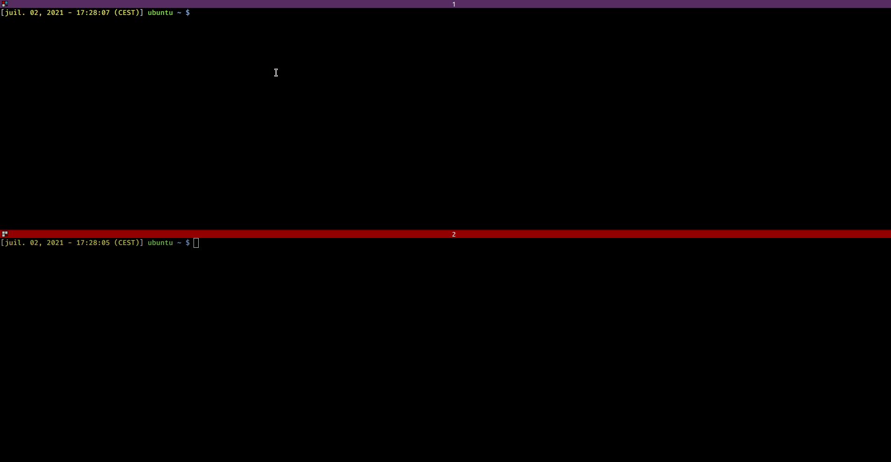
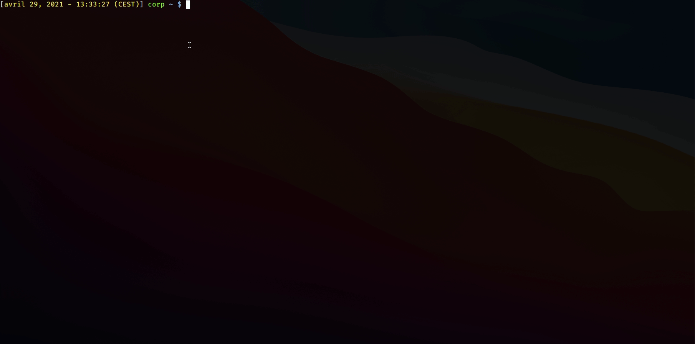
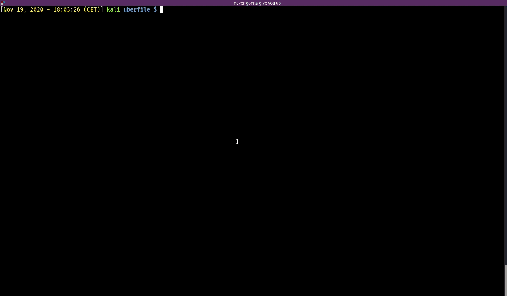

# Exegol

<p align="center">
  
  
  
  
  
  <br>
  
  
  
  <br></br>
  <a href="https://twitter.com/intent/follow?screen_name=_nwodtuhs" title="Follow"></a>
  <br><br>
</p>

**:bulb: TL;DR: Exegol is a community-driven hacking environment, powerful and yet simple enough to be used by anyone in day to day engagements.**

Exegol is a fully configured docker with many useful additional tools, resources (scripts and binaries for privesc, credential theft etc.) and some configuration (oh-my-zsh, history, aliases, colorized output for some tools). It can be used in pentest engagements, bugbounty, CTF, HackTheBox, OSCP lab & exam and so on. Exegol's original fate was to be a ready-to-hack docker in case of emergencies during engagements.

The main features of Exegol are:
- [:wrench: Tools](#wrench-tools): many tools that are either installed manually or with apt, pip, go etc. Some of those tools are in kali, some are not. Exegol doesn't come with only ultra-famous tools, you will find ones that the community loves to use, even if it's in dev/new/not famous. Some tools are pre-configured and/or customized (colored output, custom NtChallengeResponse in Responder, custom queries in BloodHound, ...)
- [:bulb: Resources](#bulb-resources): many resources can be useful during engagements. Those resources are not referred to as "tools" since they need to be run on a pwned target, and not on the attacker machine (e.g. mimikatz, rubeus, ...).
- [:scroll: History](#scroll-history): a populated history file that allows exegol users to save time and brain space by not having to remember every tool option and argument or checking the "help" every time.
- [:rocket: Aliases](#rocket-aliases): a file containing aliases that can be handful when using manually installed tools, or doing common operations.
- [:mag_right: Usage](#mag_right-usage) : a powerful Python3 wrapper used to manage Exegol container and image very easily (handles docker operations like `docker pull`, `docker build`, `docker run`, `docker start`, `docker stop`, `docker ps`, `docker rm`, `docker inspect`).

Below is an example of a Zerologon attack operated with Exegol.


Below is an example of a [ACE abuse/RBCD attack](https://www.thehacker.recipes/active-directory-domain-services/movement/abusing-aces) operated with Exegol


# :fast_forward: Quick start
Bear in mind that the install process can be long as it downloads a ~6GB image.
```
git clone https://github.com/ShutdownRepo/Exegol
cd Exegol
python3 -m pip install --user --requirement requirements.txt
python3 exegol.py start
```

Add Exegol to PATH :
```
sudo ln -s $(pwd)/exegol.py /usr/local/bin/exegol
```

# :mag_right: Usage
A powerful Python wrapper allows to manage Exegol without having to know docker-fu.

- Install (pull or build) an image : `exegol install`
- Create/start/enter a container : `exegol start`
- Execute a specific command on a container (with stdout / stderr) : `exegol start -e bloodhound`
- Execute a specific command on a container as a daemon : `exegol exec -e bloodhound`
- Stop a container : `exegol stop`
- Remove a container or an image : `exegol remove`
- Get help and advanced usage : `exegol --help`



By default, Exegol will start with display sharing allowing GUI-based programs to run, here is an example with BloodHound.



# :closed_lock_with_key: Credentials
Some tools are pre-configured with the following credentials
| Element | User | Password |
| ------- | ---- | -------- |
| wso-webshell (PHP) | | exegol4thewin |
| neo4j database | neo4j | exegol4thewin |
| bettercap ui | bettercap | exegol4thewin |
| trilium | trilium | exegol4thewin |

# :pushpin: Pre-requisites
You need python3, python3-pip, git, docker :whale:, and 15GB of free storage (*What did you expect? A fully featured pentesting environment for less than 2GB? If you've got ideas I'm all ears*).

# :wrench: Tools
The tools installed in Exegol are mostly installed from sources in order to have the latest version when deploying Exegol. Some installs are made with go, pip, apt, gem etc. You will find most of the tools in `/opt/tools`.
- CrackMapExec (https://github.com/byt3bl33d3r/CrackMapExec)
- Impacket (https://github.com/SecureAuthCorp/impacket)
- BloodHound (https://github.com/BloodHoundAD/BloodHound)
- Ghidra (https://ghidra-sre.org/)
- Powershell Empire (https://github.com/BC-SECURITY/Empire)
- ffuf (https://github.com/ffuf/ffuf)
- shellerator (https://github.com/ShutdownRepo/shellerator)
- [and many others...](https://github.com/ShutdownRepo/Exegol/wiki/Tools)

# :bulb: Resources
In addition to the many tools pre-installed and configured for some, you will find many useful pre-fetched resources like scripts and binaries in `/opt/resources`. There some pre-EoP enumeration scripts (EoP: Escalation of Privileges) and other useful binaries like Rubeus or mimikatz.
- Linux Smart Enumeration (lse.sh) (https://github.com/diego-treitos/linux-smart-enumeration)
- mimikatz (https://github.com/gentilkiwi/mimikatz)
- linPEAS & winPEAS (https://github.com/carlospolop/privilege-escalation-awesome-scripts-suite)
- sysinternals (https://docs.microsoft.com/en-us/sysinternals/downloads/)
- PowerSploit (https://github.com/PowerShellMafia/PowerSploit)
- [and many others...](https://github.com/ShutdownRepo/Exegol/wiki/Resources)

# :scroll: History
When I hack, I often rely on my history. I don't have to remember command line options, syntax and such. This history is filled with commands that I used in engagements, bugbounties, ctf, oscp and so on. Of course, the values are placeholders that need to be changed with the appropriate ones in your context.
The history is easily usable with [oh-my-zsh](https://github.com/ohmyzsh/ohmyzsh), [zsh-autosuggestions](https://github.com/zsh-users/zsh-autosuggestions), and [fzf](https://github.com/junegunn/fzf)

# :rocket: Aliases
Since many tools are manually installed in `/opt/tools/`, aliases could be heplful to use these without having to change directory manually.
Other aliases are set to save time while hacking (`http-server`, `php-server`, `urlencode`,`ipa`, ...).

# :loudspeaker: Credits & thanks
Credits and thanks go to every infosec addicts that contribute and share but most specifically to [@th1b4ud](https://twitter.com/th1b4ud) for the base ["Kali Linux in 3 seconds with Docker"](https://thibaud-robin.fr/articles/docker-kali/).

# :movie_camera: Introducing Exegol (in french w/ english subs)
<p align="center">
  <a href="http://www.youtube.com/watch?v=TA3vrNpWGvg" title="Video">
</p>
